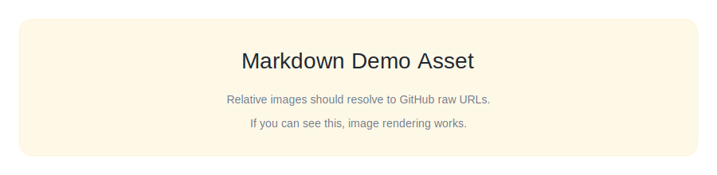

# Markdown Rendering Showcase

This skill exists to test the Skills Hub renderer.

## Features

- **Tables**
- **Task lists**
- **Footnotes**
- **Code highlighting**
- **Relative links** to [notes](./notes.md)
- **Relative images**



## Table

| Feature | Syntax | Status |
| --- | --- | --- |
| Table | `| a | b |` | OK |
| Task list | `- [ ]` | OK |
| Strike | `~~text~~` | ~~deprecated~~ |

## Task list

- [x] Render headings with anchors
- [x] Render code blocks with syntax highlight
- [x] Render tables with horizontal scroll
- [ ] Add more edge cases

## Code

```ts
export function hello(name: string) {
  return `hello, ${name}`;
}
```

> Tip: external links should open in a new tab, e.g. [skills.sh](https://skills.sh/).

Footnote reference[^1].

[^1]: `remark-gfm` provides basic footnotes support.
