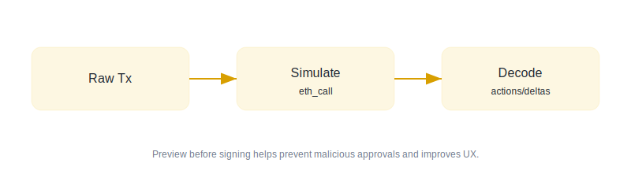

# Transaction Simulation

Preview what a transaction will do *before* the user signs.

## What this skill helps with

- Detect risky approvals (`approve`, `setApprovalForAll`)
- Show token deltas (in/out)
- Highlight suspicious contract addresses

See the [checklist](./checklist.md) for a quick review process.



## Output schema

| Field | Type | Description |
| --- | --- | --- |
| `riskLevel` | `low \| medium \| high` | Overall risk judgement |
| `actions` | `Action[]` | Parsed on-chain actions |
| `tokenDeltas` | `TokenDelta[]` | Net token changes |
| `warnings` | `string[]` | Human readable warnings |

## Example payload

You can also open a real sample payload at [examples/sample-payload.json](./examples/sample-payload.json).

```json
{
  "riskLevel": "medium",
  "warnings": ["Unlimited approval detected"],
  "actions": [
    {
      "type": "approve",
      "token": "USDT",
      "spender": "0x1111111254EEB25477B68fb85Ed929f73A960582",
      "amount": "MAX_UINT"
    }
  ]
}
```

## Implementation notes

- Prefer simulation via `eth_call` + state overrides when available
- Cache results by `(chainId, from, to, data, value)` for 60s
- Treat unknown method selectors as **high risk** until decoded
- ~~Never~~ Always show limitations to the user[^1]

## Validation tasks

- [ ] Transaction decoding covers common routers (Uniswap V2/V3, 1inch)
- [ ] Approvals show *spender* and amount (with an "unlimited" badge)
- [ ] External links open in a new tab: [EIP-1559](https://eips.ethereum.org/EIPS/eip-1559)

[^1]: Simulation is not perfect. Network RPCs can lie or be rate-limited, and contract behavior can depend on current state.
